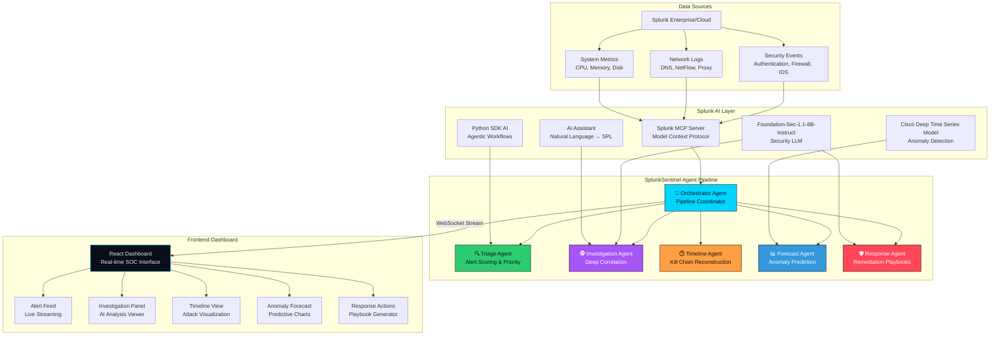

# Architecture Diagram

## Data Flow

1. **Ingest** — Security events from Splunk flow through the MCP Server into SplunkSentinel
2. **Triage** — Triage Agent uses Foundation-Sec to score and prioritize alerts by severity
3. **Investigate** — Investigation Agent queries Splunk for correlated evidence across indexes
4. **Timeline** — Timeline Agent reconstructs the complete attack kill chain
5. **Forecast** — Forecast Agent uses Cisco DTSM to predict future anomaly windows
6. **Respond** — Response Agent generates tailored remediation playbooks with SPL queries
7. **Visualize** — React dashboard displays all agent outputs in real-time via WebSocket
